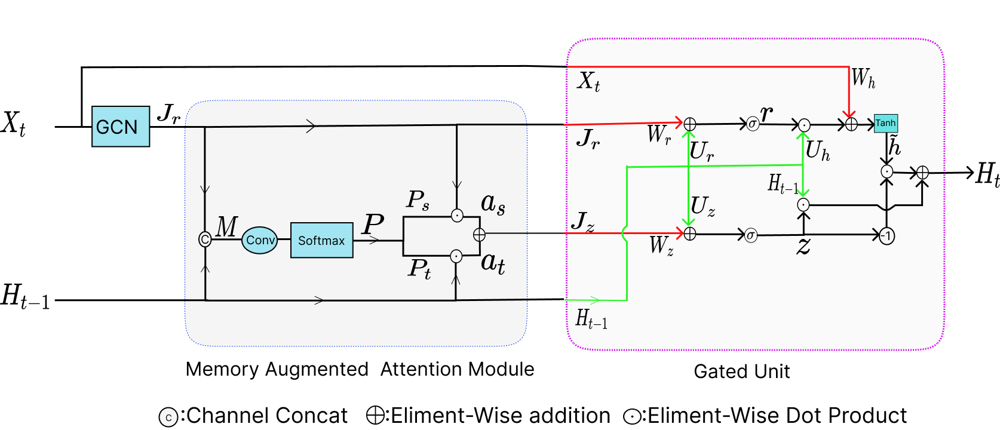

# STLGRU: Spatio-Temporal Lightweight Graph GRU for Traffic Flow Prediction



This is the official implementation of STLGRU: Spatio-Temporal Lightweight Graph GRU for Traffic Flow Prediction: \
Kishor Kumar Bhaumik, Fahim Faisal Niloy, Saif mahmud and Simon S. Woo [STLGRU: Spatio-Temporal Lightweight Graph GRU for Traffic Flow Prediction](https://arxiv.org).

Dependency can be installed using the following command:
```bash
pip install -r requirement.txt
```


## Data Preparation
Download the dataset(PEMS03, PEMS04, PEMS07, PEMS08) from here, [Baidu Drive](https://pan.baidu.com/s/1pbRUmRg_Y69KRNEuKZParQ), and the password is <b>1s5t</b>.
Download METR-LA and PEMS-BAY data from [Google Drive](https://drive.google.com/open?id=10FOTa6HXPqX8Pf5WRoRwcFnW9BrNZEIX) or [Baidu Yun](https://pan.baidu.com/s/14Yy9isAIZYdU__OYEQGa_g) links provided by [DCRNN](https://github.com/liyaguang/DCRNN), and should be
put into the `data/` folder.

## Process raw data for METR-LA and PEMS-BAY

```
# Create data directories
mkdir -p data/{METR-LA,PEMS-BAY}

# METR-LA
python generate_training_data.py --output_dir=data/METR-LA --traffic_df_filename=data/metr-la.h5

# PEMS-BAY
python generate_training_data.py --output_dir=data/PEMS-BAY --traffic_df_filename=data/pems-bay.h5


## Train Commands

```
python train.py --device cuda:0
```

## Test Commands

```
python test.py --checkpoint garage8/PEMS08_epoch_158_16.75.pth --batch_size 1 --device cuda:0
```
